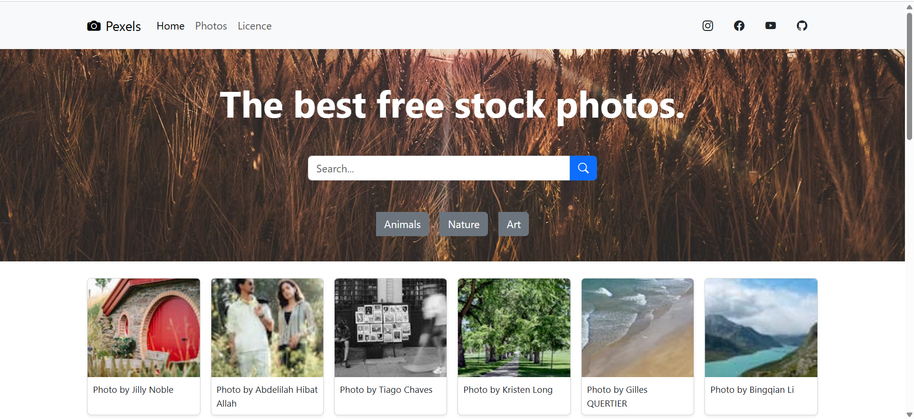

# 📸 M4S2D1 – Album di Fotografie

Benvenutə in M4S2D1 – Album di Fotografie, una galleria web interattiva creata con HTML, CSS e JavaScript. Un piccolo progetto che mette insieme stile, interattività e semplicità per mostrare le tue fotografie in un layout elegante e dinamico.

### 📚 Home Page   
 

---

## 🧾 Struttura del progetto
- `index.html` – Pagina principale dell’album fotografico.
- `stile.css` – Definisce il design, il layout e lo stile visivo dell’album.
- `scrypt.js` – Contiene la logica JavaScript per animazioni, interazioni o funzionalità dinamiche dell’album.
- `.vscode/` – Configurazioni dell’ambiente di sviluppo (editor, formattazione, ecc.).

___

## 🛠️ Tecnologie utilizzate

 (~45 %) — per la struttura semantica della pagina  
 (~47 %) — per la logica interattiva  
 (~7 %) — per lo stile visivo e layout  

___

## 🧾 Caratteristiche principali
- Layout responsive – Il design si adatta ad diverse dimensioni dello schermo (da dispositivi mobili a desktop).
- Animazioni e interazioni – Eventuali click, hover o transizioni per rendere più viva l’esperienza.
- Design semplice ed elegante – Colori, spaziatura e tipografia armoniosi per mettere in risalto le immagini.
- Facilmente estendibile – Aggiungi, modifica o personalizza le foto, stili o interattività con facilità.

___

## 📌 Come usare questo progetto

Clona la repository con:
```
- git clone https://github.com/Alina-Galben/M4S2D1-Album-di-fotografie.git
- Apri index.html nel browser.
- Esplora la galleria fotografica e interagisci con le transizioni.
- Personalizza le immagini, i colori, le animazioni dal tuo editor di testo preferito!
```
___

## 🧠 Possibili miglioramenti futuri

- Aggiungere una slideshow automatica o controllata manualmente.
- Inserire didascalie o descrizioni testuali per ogni foto.
- Implementare lightbox per ingrandire le immagini con un overlay.
- Rendere il caricamento delle immagini dinamico (da JSON o API).
- Aggiungere filtri, griglie o categorie per raggruppare le foto.

___

## Perché questo progetto?
Questo piccolo “album digitale” è una dimostrazione efficace della combinazione tra markup strutturato (HTML), stile visivo (CSS) e interattività (JavaScript). È perfetto per imparare o mostrare competenze base di sviluppo web front-end in modo semplice e creativo.

___

## 📄 Licence: 
- Progetto open source, creato a scopo formativo.
- Sentiti libero di clonarlo, modificarlo o contribuire! 🌟

## 📩 Contatti: 
🔗 LinkedIn: www.linkedin.com/in/alina-galben<br>
📫 Email: alina.galben@gmail.com<br>
📍 Disponibile a Catania e provincia, oppure per lavori da remoto!<br>


